# Unsupervised Anomaly Detection on Mixed-Type Medical Data

> **MSc Project** - Advanced Unsupervised Learning
> **Authors:** Mirko Morello, Andrea Borghesi
> **University:** University of Milano-Bicocca
> **Date:** January 2025

[](https://www.python.org/)
[](https://pytorch.org/)
[](https://scikit-learn.org/)

<p align="center">
  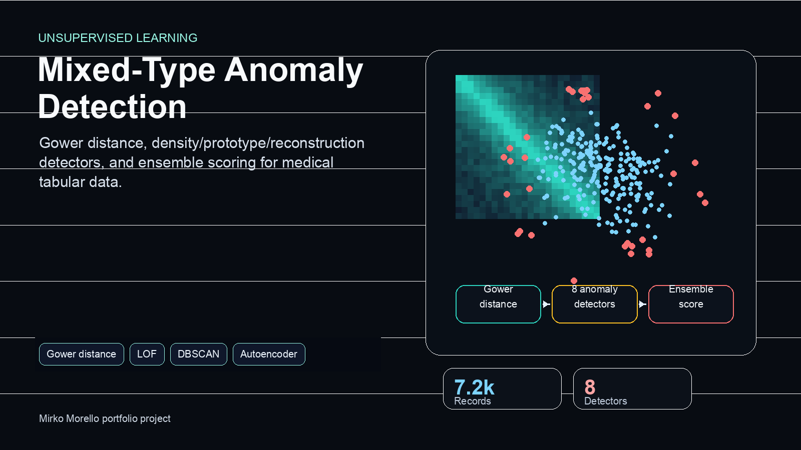
</p>

---

## 📋 Table of Contents

- [Overview](#-overview)
- [Key Features](#-key-features)
- [Dataset](#-dataset)
- [Methodologies](#-methodologies)
  - [Custom Gower's Distance](#1-custom-gowers-distance-implementation)
  - [Proximity-Based Methods](#2-proximity-based-anomaly-detection)
  - [Prototype-Based Methods](#3-prototype-based-anomaly-detection)
  - [Reconstruction-Based Methods](#4-reconstruction-based-anomaly-detection)
  - [Ensemble Methods](#5-ensemble-methods)
- [Results](#-results)
- [Installation](#-installation)
- [Usage](#-usage)
- [Project Structure](#-project-structure)
- [Technical Details](#-technical-details)
- [References](#-references)

---

## 🎯 Overview

This project explores and compares **multiple unsupervised anomaly detection algorithms** on a high-dimensional medical dataset containing **mixed-type data** (numerical and categorical features). The core challenge lies in effectively handling this heterogeneous data structure, which required developing custom distance metrics and adapted implementations of classical algorithms.

**Anomaly detection** is crucial in domains like:
- 🏥 Medical diagnosis and health monitoring
- 🔒 Fraud detection and cybersecurity
- 🏭 Manufacturing quality control
- 🌐 Network intrusion detection

This project demonstrates a comprehensive approach to unsupervised anomaly detection, implementing methods from three major categories:
- **Proximity-based** (k-NN, LOF, COF, DBSCAN)
- **Prototype-based** (K-Means++)
- **Reconstruction-based** (PCA, Autoencoders)

---

## ✨ Key Features

### 🔧 Custom Gower's Distance Implementation

**Why it matters:** Standard distance metrics (Euclidean, Manhattan) are inappropriate for mixed-type data. Our custom implementation:

- ✅ **Handles mixed data types** - Combines Euclidean distance for numerical features and Hamming distance for categorical features
- ✅ **Optimized performance** - ~10 seconds on high-end processor (7,200 × 7,200 matrix)
- ✅ **Flexible design** - Supports multiple distance metrics without forced normalization
- ✅ **Faster than existing libraries** - Outperforms open-source alternatives

```python
# Gower distance combines multiple metrics
proximity = (numerical_distance + categorical_distance) / total_features
```


*Figure 1: Proximity matrix computed with custom Gower's distance showing data structure*

### 🎯 Comprehensive Anomaly Detection Suite

Implemented and evaluated **8 different methods**:
1. **k-Nearest Neighbor (k-NN)** - Distance-based
2. **Local Outlier Factor (LOF)** - Density-based
3. **Connectivity Outlier Factor (COF)** - Graph-based
4. **DBSCAN** - Clustering-based
5. **K-Means++** with custom Gower distance
6. **Principal Component Analysis (PCA)** - Reconstruction-based
7. **Autoencoder** - Deep learning approach
8. **Ensemble methods** - Combining multiple detectors

### 📊 Advanced Thresholding

- **Two-stage IQR (Interquartile Range)** method
- Reduces bias from anomalies in the data
- More accurate boundary detection

---

## 📊 Dataset

### Characteristics

- **Size:** 7,200 observations
- **Original features:** 23 (reduced to 21 after cleaning)
- **Feature types:** Mixed (numerical + categorical)
  - **Numerical features:** 5 continuous variables (standardized with Z-score)
  - **Categorical features:** 16 binary/boolean features (one-hot encoded)
- **Domain:** Medical/patient data
- **Labels:** Not provided (unsupervised learning task)

### Data Preprocessing

1. **Feature removal:** Dropped 2 empty columns
2. **Type conversion:**
   - String → float64 for numerical features
   - String → boolean for categorical features
3. **Standardization:** Z-score normalization (mean=0, std=1) for numerical features
4. **Validation:** No missing values detected

### Data Exploration

Due to high dimensionality (21 features), visualization techniques were employed:
- **PCA (Principal Component Analysis)** - Linear dimensionality reduction
- **t-SNE (t-Distributed Stochastic Neighbor Embedding)** - Non-linear manifold learning
- **Feature combination plots** - All pairs of numerical features

These visualizations served as validation tools throughout the anomaly detection process.

---

## 🔬 Methodologies

### 1. Custom Gower's Distance Implementation

**Problem:** Traditional distance metrics fail with mixed-type data.

**Solution:** Implemented Gower's distance, which properly handles heterogeneous features:

```python
def proximity_matrix(data_x, data_y=None, metrics={'numeric': 'euclidean', 'categorical': 'hamming'}, cat_features=[]):
    """
    Computes proximity matrix for mixed-type data using Gower's distance.

    Parameters:
    -----------
    data_x : pandas DataFrame
        Input dataset
    metrics : dict
        Distance metrics for each feature type
    cat_features : list
        Names of categorical features

    Returns:
    --------
    prox_matrix : numpy array
        Proximity/distance matrix
    """
    # Separate numerical and categorical features
    X_num = numerical features
    X_cat = categorical features

    # Apply appropriate metrics
    for each data point:
        num_dist = euclidean_distance(x_num, Y_num)
        cat_dist = hamming_distance(x_cat, Y_cat)

        # Combined distance (Gower)
        prox_matrix[i,:] = (num_dist + cat_dist) / total_features

    return prox_matrix
```

**Key Insights:**
- Hamming distance and Minkowski distances behave identically on binary data
- Boolean features can be treated as floats if rounded during centroid updates
- This observation enables performance optimizations

---

### 2. Proximity-Based Anomaly Detection

#### 2.1 k-Nearest Neighbor (k-NN)

**Principle:** Anomalies have larger distances to their k-nearest neighbors.

**Implementation:**
- Computed distance to 5th nearest neighbor for each point
- Applied two-stage IQR thresholding

**Results:**
- **Anomalies detected:** 693 (9.62%)
- **Performance:** Good separation between normal and anomalous points


*Figure 2: Histogram of distances to 5th nearest neighbor*

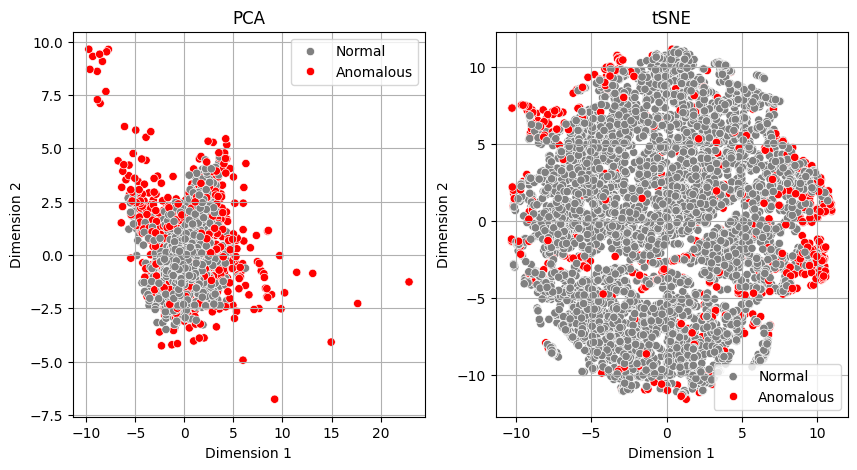
*Figure 3: k-NN anomaly detection results (PCA & t-SNE projection)*

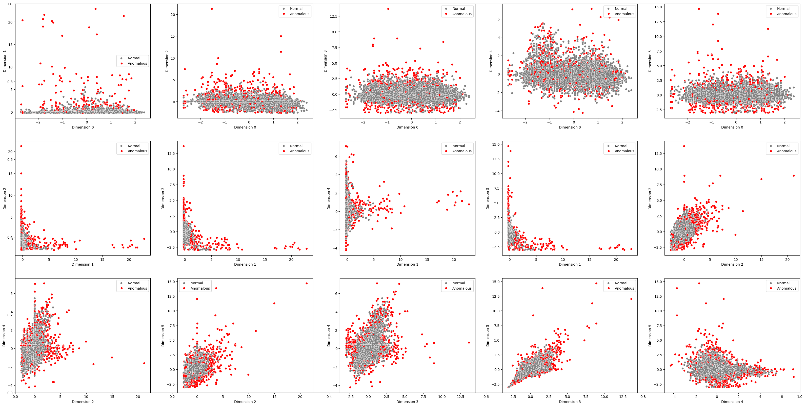
*Figure 4: k-NN results across all numerical feature combinations*

---

#### 2.2 Local Outlier Factor (LOF)

**Principle:** Compares local density of a point to the densities of its neighbors.

**Challenge:** Highly sensitive to curse of dimensionality.

**Results:**
- **Anomalies detected:** 1,089 (15.11%)
- **Issue:** LOF scores ranged from 0.8 to 1.5 × 10⁸
- **Problem:** High-dimensional sparsity caused inflated scores
- **Verdict:** Many false positives; not suitable for this high-dimensional dataset

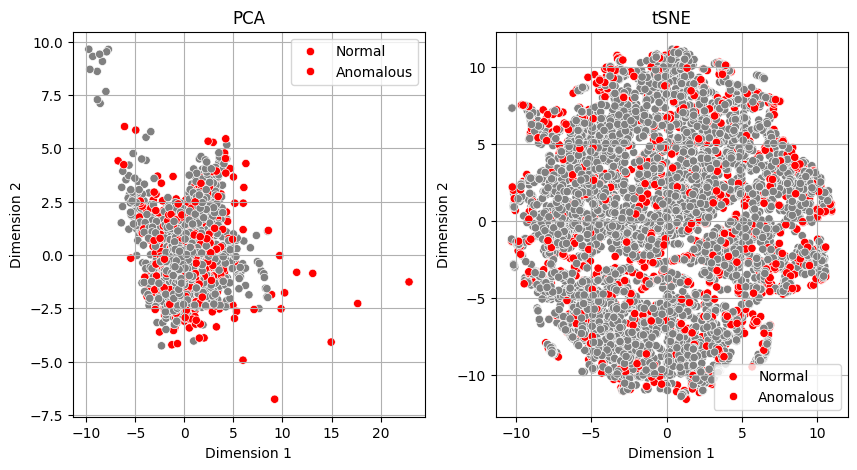
*Figure 5: LOF struggles with high-dimensional data*

---

#### 2.3 Connectivity Outlier Factor (COF)

**Principle:** Graph-based variant of LOF; considers connectivity through shortest paths.

**Advantage:** Less sensitive to dimensionality than LOF.

**Results:**
- **Anomalies detected:** 1,034 (14.36%)
- **Performance:** Better than LOF but still shows false positives

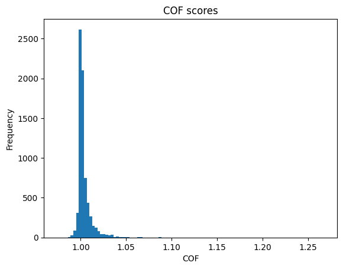
*Figure 6: COF score distribution*

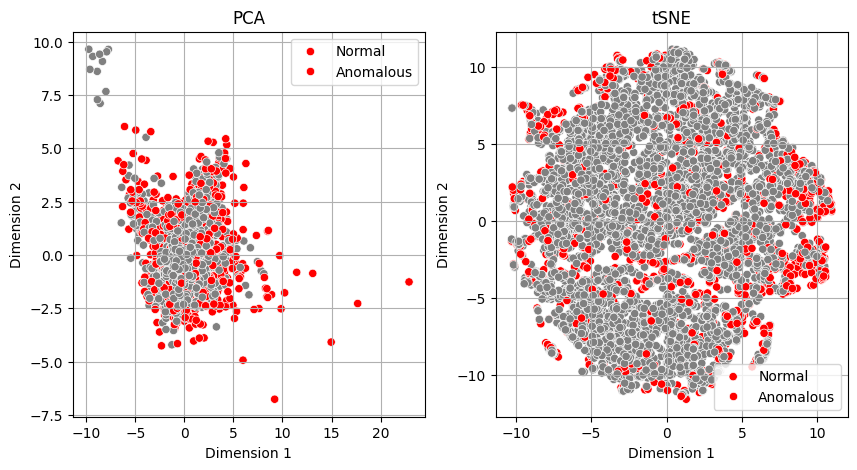
*Figure 7: COF anomaly detection results*

---

#### 2.4 DBSCAN

**Principle:** Density-based clustering; noise points = anomalies.

**Parameters:**
- eps = 0.075
- min_samples = 5

**Results:**
- **Anomalies detected:** 421 (5.85%)
- **Performance:** Very promising; correctly identifies outliers across multiple dimensions

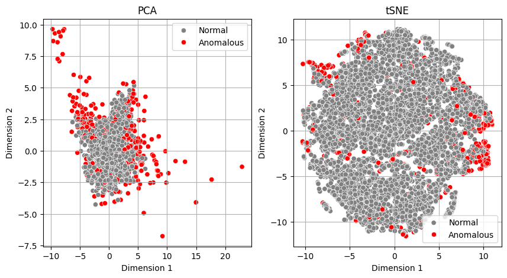
*Figure 8: DBSCAN effectively identifies anomalies*

---

### 3. Prototype-Based Anomaly Detection

#### K-Means++ with Gower Distance

**Standard K-Means problem:** Cannot handle mixed-type data properly.

**Our Solution:**

1. **Custom centroid structure:** Boolean features remain boolean, not converted to float
2. **Custom distance:** Gower's distance for assignments
3. **Custom updates:**
   - Float features: Mean
   - Boolean features: Mode (majority vote)

**Mathematical Insight:**

For boolean features, the mode can be computed efficiently:

```
mode = average > 0.5 ? True : False
```

This means we can treat booleans as floats and round after averaging, enabling significant optimization.

**Optimization Result:**
- Naive implementation: Very slow
- Optimized implementation: **~100× faster**
- Still slower than scikit-learn's Cython implementation, but necessary for proper mixed-type handling

**Finding Optimal Clusters:**

Used the **elbow method** with second derivative analysis:
- Elbow point = minimum of second derivative
- Ran 500 iterations to handle fluctuations
- **Optimal number of clusters: 5-6**


*Figure 9: Elbow method analysis showing optimal clusters*

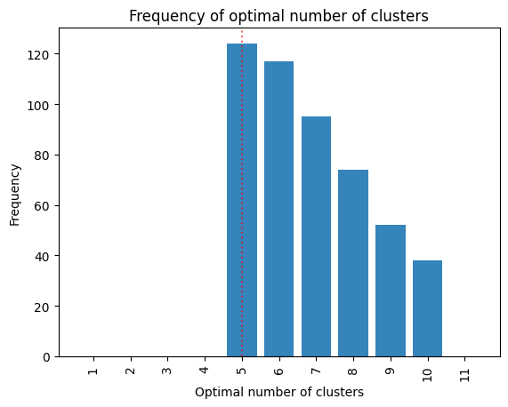
*Figure 10: Distribution of optimal k from 500 runs*

**Results:**
- **Anomalies detected:** 304 (4.22%)
- **Performance:** Excellent; identifies outer layer of data distribution
- **Quality:** One of the best-performing methods

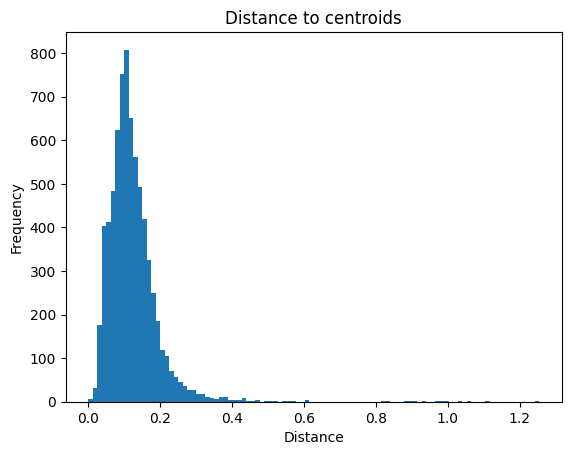
*Figure 11: Distance to centroid distribution*

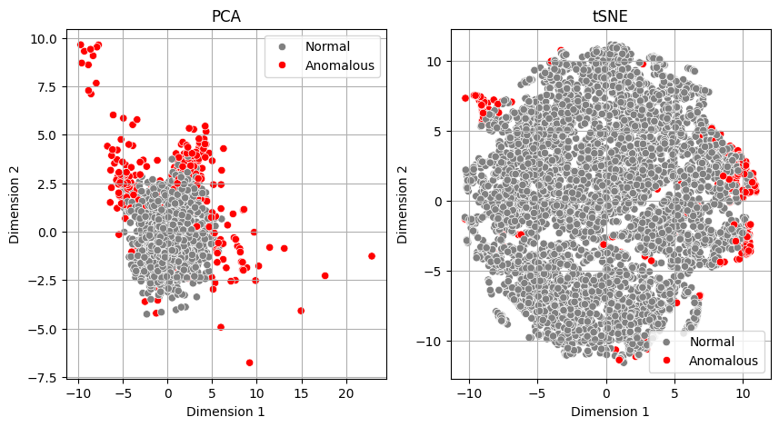
*Figure 12: K-Means anomaly detection results*

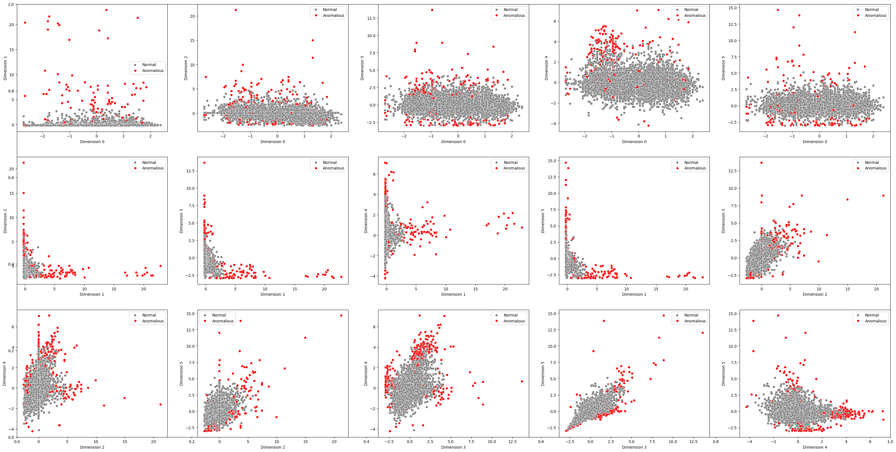
*Figure 13: K-Means consistently identifies boundary anomalies*

---

### 4. Reconstruction-Based Anomaly Detection

#### 4.1 Principal Component Analysis (PCA)

**Principle:** Anomalies have high reconstruction error when projected to lower dimensions.

**Implementation:**
- Tested multiple component numbers
- Selected 6 components for optimal representation
- Computed reconstruction error using Gower's distance

**Results:**
- **Anomalies detected:** 79 (1.1%)
- **Issue:** Reconstruction error distribution doesn't follow expected Gaussian pattern
- **Verdict:** Successfully reconstructed some apparent anomalies; not ideal for this task

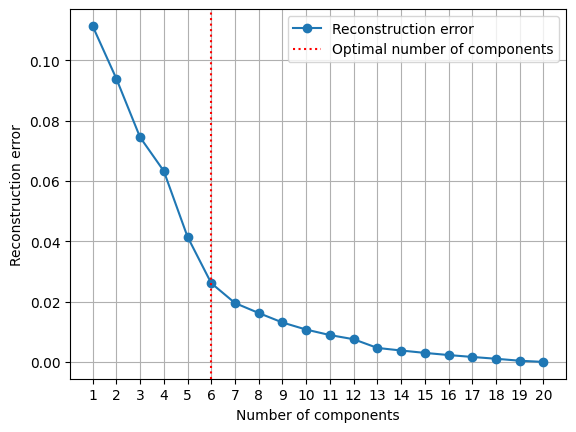
*Figure 14: Reconstruction error vs. number of components*

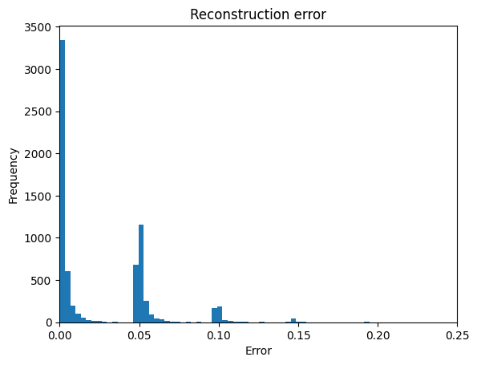
*Figure 15: PCA reconstruction error histogram*

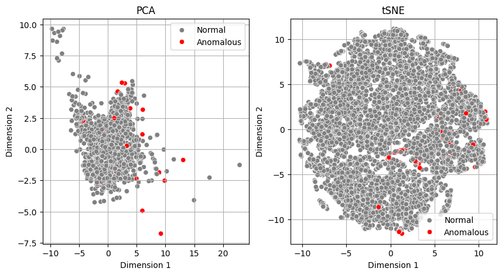
*Figure 16: PCA anomaly detection results*

---

#### 4.2 Autoencoder (Neural Network)

**Architecture:**
```
Encoder:  Input(21) → Linear(6) → ReLU
Decoder:  Linear(6) → Linear(21) → Sigmoid
```

**Training:**
- 100 epochs
- Batch size: 32
- Optimizer: Adam (lr=0.001)
- Loss: MSE (Mean Squared Error)
- Training time: ~1.5 minutes

**Results:**
- **Anomalies detected:** 284 (3.94%)
- **Performance:** Excellent; similar quality to k-NN
- **Advantage:** Captures complex non-linear patterns

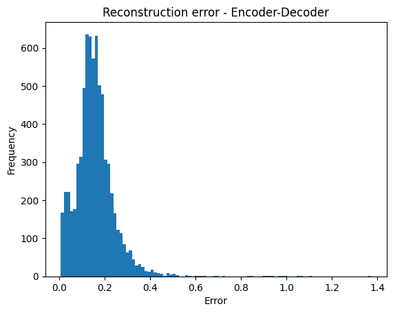
*Figure 17: Autoencoder reconstruction error histogram*


*Figure 18: Autoencoder effectively identifies anomalies*

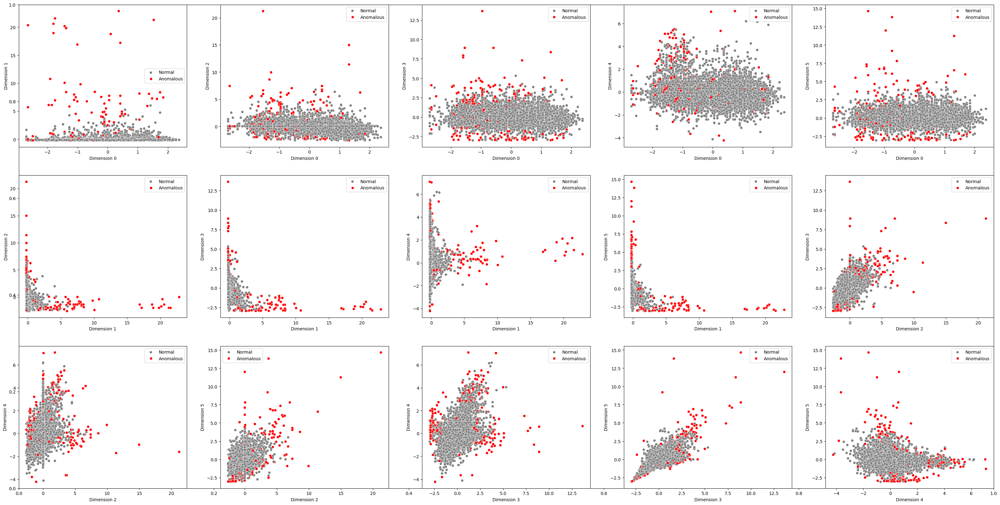
*Figure 19: Autoencoder results across feature combinations*

---

### 5. Ensemble Methods

**Goal:** Combine multiple detectors for robust anomaly detection.

**Methods evaluated:** K-Means, Autoencoder, k-NN (the three best-performing individual methods)

#### 5.1 AND Ensemble (Consensus)

**Rule:** Flag anomaly only if **ALL** methods agree.

**Results:**
- **Anomalies detected:** 163 (2.26%)
- **Characteristics:** Very conservative; minimizes false positives but may miss true anomalies

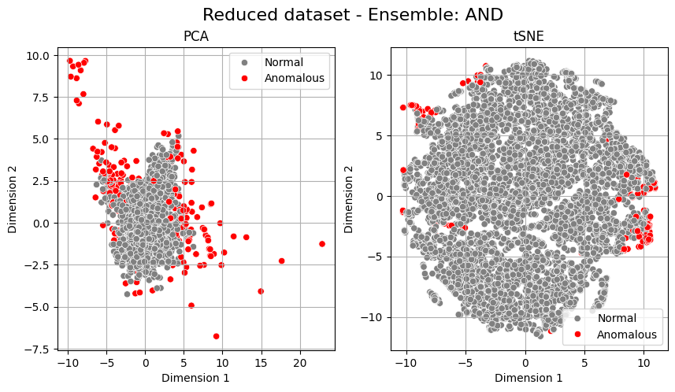
*Figure 20: AND ensemble - high precision, lower recall*

---

#### 5.2 OR Ensemble (Union)

**Rule:** Flag anomaly if **ANY** method agrees.

**Results:**
- **Anomalies detected:** 792 (11.00%)
- **Characteristics:** Maximizes anomaly coverage but includes more false positives

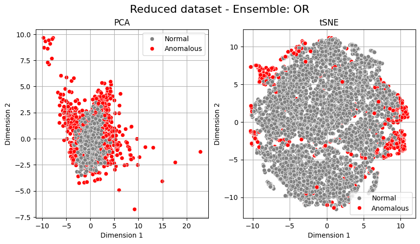
*Figure 21: OR ensemble - high recall, lower precision*

---

#### 5.3 Weighted Sum Ensemble ⭐ **Best Method**

**Rule:** Combine normalized anomaly scores with equal weights (1/3 each).

```python
# Normalize all scores to [0, 1]
normalized_scores = [score / max(score) for score in [kmeans, autoencoder, knn]]

# Weighted combination
final_score = 0.333 * kmeans + 0.333 * autoencoder + 0.333 * knn

# Apply two-stage IQR threshold
anomalies = final_score > threshold
```

**Results:**
- **Anomalies detected:** 402 (5.58%)
- **Performance:** **Best overall method** ⭐
- **Quality:**
  - Excludes clear anomalies
  - Forms compact main cluster
  - Minimal false positives
  - Balanced precision and recall

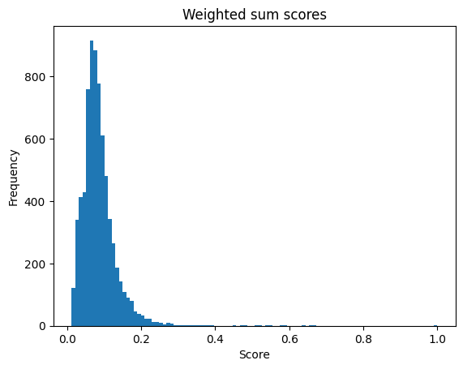
*Figure 22: Weighted sum score distribution shows clear separation*


*Figure 23: Weighted sum ensemble gives the most coherent anomaly view in the unsupervised analysis. Without ground-truth labels, this remains a qualitative and agreement-based assessment.*

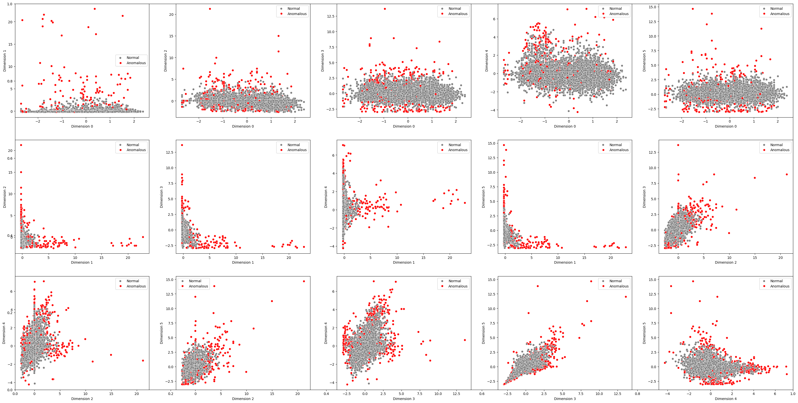
*Figure 24: Weighted sum consistently identifies true anomalies across all feature combinations*

---

## 📈 Results

### Method Comparison

| Method | Anomalies Detected | Percentage | Performance |
|--------|-------------------|------------|-------------|
| **Weighted Sum Ensemble** ⭐ | 402 | 5.58% | ⭐⭐⭐⭐⭐ Excellent |
| DBSCAN | 421 | 5.85% | ⭐⭐⭐⭐⭐ Excellent |
| K-Means++ | 304 | 4.22% | ⭐⭐⭐⭐⭐ Excellent |
| Autoencoder | 284 | 3.94% | ⭐⭐⭐⭐⭐ Excellent |
| k-NN | 693 | 9.62% | ⭐⭐⭐⭐ Good |
| AND Ensemble | 163 | 2.26% | ⭐⭐⭐ Conservative |
| PCA | 79 | 1.1% | ⭐⭐ Limited |
| OR Ensemble | 792 | 11.00% | ⭐⭐ Too Permissive |
| COF | 1,034 | 14.36% | ⭐ Many False Positives |
| LOF | 1,089 | 15.11% | ⭐ Poor (High-D issues) |

### Coherence Analysis

**Adjusted Rand Index (ARI)** between methods:

|              | NN    | LOF   | DBSCAN | COF   | K-Means | Autoencoder | PCA   | Weighted Sum |
|--------------|-------|-------|--------|-------|---------|-------------|-------|--------------|
| **NN**           | 1.000 | 0.345 | 0.704  | 0.462 | 0.423   | 0.386       | 0.156 | **0.581**    |
| **LOF**          | 0.345 | 1.000 | 0.250  | 0.437 | 0.097   | 0.087       | 0.061 | 0.155        |
| **DBSCAN**       | 0.704 | 0.250 | 1.000  | 0.348 | 0.540   | 0.446       | 0.236 | **0.664**    |
| **COF**          | 0.462 | 0.437 | 0.348  | 1.000 | 0.213   | 0.186       | 0.090 | 0.298        |
| **K-Means**      | 0.423 | 0.097 | 0.540  | 0.213 | 1.000   | 0.593       | 0.222 | **0.750**    |
| **Autoencoder**  | 0.386 | 0.087 | 0.446  | 0.186 | 0.593   | 1.000       | 0.149 | **0.689**    |
| **PCA**          | 0.156 | 0.061 | 0.236  | 0.090 | 0.222   | 0.149       | 1.000 | 0.219        |
| **Weighted Sum** | 0.581 | 0.155 | 0.664  | 0.298 | **0.750** | **0.689**   | 0.219 | 1.000        |

**Key Findings:**
- ✅ Best-performing methods (K-Means, Autoencoder, k-NN, DBSCAN) show strong agreement
- ✅ Weighted sum ensemble has highest correlation with individual best methods
- ❌ LOF shows poor agreement (confirms its unsuitability for high-dimensional data)
- ❌ PCA shows low agreement with all methods

### Conclusions

1. **Optimal anomaly rate:** 5-9% of the dataset (~360-650 observations)
2. **Best single method:** K-Means++ with custom Gower distance
3. **Best overall approach:** Weighted Sum Ensemble
4. **Critical insight:** Proper handling of mixed-type data is essential
5. **Recommendation:** Use ensemble methods for robust detection

---

## 🚀 Installation

### Prerequisites

- Python 3.8+
- pip or conda

### Install Dependencies

```bash
# Clone the repository
git clone https://github.com/yourusername/MSc_Unsupervised_Learning.git
cd MSc_Unsupervised_Learning

# Create virtual environment (optional but recommended)
python -m venv venv
source venv/bin/activate  # On Windows: venv\Scripts\activate

# Install required packages
pip install numpy pandas scikit-learn matplotlib seaborn torch tqdm
```

### Requirements

```txt
pandas>=1.3.0
numpy>=1.21.0
matplotlib>=3.4.0
seaborn>=0.11.0
scikit-learn>=1.0.0
torch>=1.9.0
scipy>=1.7.0
tqdm>=4.62.0
kneed>=0.7.0
pythresh>=0.2.0
torchsummary>=1.5.0
```

---

## 💻 Usage

### Quick Start

```python
import pandas as pd
import numpy as np
from sklearn.preprocessing import StandardScaler

# Load and preprocess data
df = pd.read_csv('datasets/data.csv', sep=';', index_col='Row')

# Data cleaning
df = df.replace(',', '.', regex=True)
df.drop(['Unnamed: 22', 'Unnamed: 23'], axis=1, inplace=True)

# Identify feature types
int_cols = df.select_dtypes(include=['int64']).columns
for col in int_cols:
    if df[col].nunique() == 2:
        df[col] = df[col].astype(bool)

bool_cols = df.select_dtypes(include=['bool']).columns
float_cols = df.select_dtypes(exclude=['bool']).columns
df[float_cols] = df[float_cols].astype(float)

# Standardize numerical features
scaler = StandardScaler()
df[float_cols] = scaler.fit_transform(df[float_cols])
```

### Compute Gower's Distance

```python
def proximity_matrix(data_x, data_y=None,
                    metrics={'numeric': 'euclidean', 'categorical': 'hamming'},
                    cat_features=[]):
    """
    Compute proximity matrix using Gower's distance.
    See main.py for full implementation.
    """
    # Implementation in main.py (lines 316-370)
    pass

# Compute proximity matrix
prox_mat = proximity_matrix(data_x=df, cat_features=bool_cols)
```

### Run Anomaly Detection

#### k-NN Approach

```python
from sklearn.neighbors import NearestNeighbors

# k-NN anomaly detection
k = 5
knn = NearestNeighbors(n_neighbors=k-1, metric='precomputed')
knn.fit(prox_mat)
dist, idx = knn.kneighbors()
knn_score = dist[:, -1]

# Apply two-stage IQR threshold
threshold = two_stage_iqr_bound(knn_score)
anomalies = np.where(knn_score > threshold)[0]
```

#### K-Means with Gower Distance

```python
def kmeans_gower_optimized(data, n_clusters, max_iter=300, random_state=None):
    """
    K-Means with proper mixed-type handling.
    See main.py for full implementation (lines 832-879).
    """
    pass

# Run K-Means
labels, centroids, inertia = kmeans_gower_optimized(df, n_clusters=5, max_iter=300)

# Compute distances to centroids
prox_centers = proximity_matrix(data_x=df, data_y=centroids_df, cat_features=bool_cols)
km_scores = np.min(prox_centers, axis=1)

# Threshold
threshold = two_stage_iqr_bound(km_scores)
anomalies = np.where(km_scores > threshold)[0]
```

#### Autoencoder

```python
import torch
import torch.nn as nn

class Autoencoder(nn.Module):
    def __init__(self, input_dim, encoding_dim):
        super(Autoencoder, self).__init__()
        self.encoder = nn.Sequential(
            nn.Linear(input_dim, encoding_dim),
            nn.ReLU()
        )
        self.decoder = nn.Sequential(
            nn.Linear(encoding_dim, input_dim),
            nn.Sigmoid()
        )

    def forward(self, x):
        encoded = self.encoder(x)
        decoded = self.decoder(encoded)
        return decoded

# Train autoencoder (see main.py lines 1315-1399)
autoencoder = Autoencoder(input_dim=21, encoding_dim=6)
# ... training code ...

# Compute reconstruction error
with torch.no_grad():
    reconstructed = autoencoder(tensor_data)
ed_score = compute_reconstruction_error(df, reconstructed_df, bool_cols)

# Threshold
threshold = two_stage_iqr_bound(ed_score)
anomalies = np.where(ed_score > threshold)[0]
```

#### Weighted Sum Ensemble

```python
# Normalize scores
methods_scores = [km_scores, ed_score, knn_score]
normalized_scores = [score/np.max(score) for score in methods_scores]

# Equal weighting
weights = [1/3, 1/3, 1/3]

# Weighted sum
ws_scores = sum(score * weight for score, weight in zip(normalized_scores, weights))

# Threshold
threshold = two_stage_iqr_bound(ws_scores)
anomalies = np.where(ws_scores > threshold)[0]

print(f"Detected {len(anomalies)} anomalies ({len(anomalies)/len(df)*100:.2f}%)")
```

### Visualization

```python
from sklearn.decomposition import PCA
from sklearn.manifold import TSNE
import matplotlib.pyplot as plt
import seaborn as sns

def visualize_results(data, labels, title=''):
    # PCA
    pca = PCA(n_components=2)
    pca_result = pca.fit_transform(data)

    # t-SNE
    tsne = TSNE(n_components=2, perplexity=20, n_iter=300)
    tsne_result = tsne.fit_transform(data)

    # Plot
    fig, (ax1, ax2) = plt.subplots(1, 2, figsize=(12, 5))

    sns.scatterplot(x=pca_result[:,0], y=pca_result[:,1],
                    hue=labels, palette=['gray', 'red'], ax=ax1)
    ax1.set_title(f'PCA - {title}')

    sns.scatterplot(x=tsne_result[:,0], y=tsne_result[:,1],
                    hue=labels, palette=['gray', 'red'], ax=ax2)
    ax2.set_title(f't-SNE - {title}')

    plt.show()

# Create labels: 1 = normal, -1 = anomaly
labels = np.ones(len(df))
labels[anomalies] = -1

visualize_results(df, labels, title='Anomaly Detection Results')
```

---

## 📁 Project Structure

```
MSc_Unsupervised_Learning/
│
├── Final_project/
│   ├── main.py                              # Main implementation (1,552 lines)
│   ├── main.tex                             # LaTeX report source
│   ├── Unsupervised_Learning__Final_project.pdf  # Full project report
│   ├── 2023-2024 - Unsupervised Learning - Exam.pdf  # Assignment
│   │
│   └── images/                              # All visualization outputs
│       ├── proxmat.png                      # Proximity matrix
│       ├── NN_*.png                         # k-NN results
│       ├── LOF_*.png                        # LOF results
│       ├── DBSCAN_*.png                     # DBSCAN results
│       ├── COF_*.png                        # COF results
│       ├── KM_*.png                         # K-Means results
│       ├── PCA_*.png                        # PCA results
│       ├── ED_*.png                         # Autoencoder results
│       ├── WS_*.png                         # Weighted sum results
│       ├── AND_*.png                        # AND ensemble
│       └── OR_*.png                         # OR ensemble
│
├── datasets/
│   ├── data.csv                             # Original dataset
│   ├── data_with_anomaly.csv               # With anomaly scores
│   └── fortune500(2017-2021).csv           # Additional dataset
│
├── Lessons_notes/                           # Course materials
│
├── README.md                                # This file
├── README.md                                # Main documentation
└── .gitignore

```

---

## 🔧 Technical Details

### Computational Complexity

| Operation | Time Complexity | Space Complexity | Actual Time (7,200 samples) |
|-----------|----------------|------------------|------------------------------|
| Gower's Distance Matrix | O(n² × m) | O(n²) | ~10 seconds |
| k-NN Distance Computation | O(n² × k) | O(n × k) | ~5 seconds |
| K-Means (custom) | O(i × n × k × m) | O(n × m) | ~30 seconds (300 iter) |
| COF Shortest Paths | O(n³) | O(n²) | ~9 minutes |
| Autoencoder Training | O(e × b × n × m) | O(m) | ~90 seconds (100 epochs) |

Where:
- n = number of samples (7,200)
- m = number of features (21)
- k = number of neighbors/clusters (5-6)
- i = iterations
- e = epochs
- b = batch operations

### Thresholding Strategy

**Two-Stage IQR Method:**

```python
def two_stage_iqr_bound(scores):
    """
    Two-stage IQR thresholding reduces bias from anomalies.

    Stage 1: Remove obvious outliers
    Stage 2: Recalculate bounds on cleaner data
    """
    # Stage 1
    q1, q3 = np.percentile(scores, [25, 75])
    iqr = q3 - q1
    upper_bound_1 = q3 + 1.5 * iqr

    # Keep non-outliers
    clean_scores = scores[scores <= upper_bound_1]

    # Stage 2
    q1, q3 = np.percentile(clean_scores, [25, 75])
    iqr = q3 - q1
    upper_bound_2 = q3 + 1.5 * iqr

    return upper_bound_2
```

### Optimization Techniques

1. **Vectorized Operations:** NumPy broadcasting for distance computations
2. **Multi-threading:** Used for elbow method iterations
3. **Memory Management:** Garbage collection for large matrix operations
4. **Boolean Optimization:** Treating booleans as floats with rounding

---

## 📚 References

### Academic Papers

1. **Arthur, D., & Vassilvitskii, S. (2007)**
   *k-means++: The advantages of careful seeding*
   Proceedings of the eighteenth annual ACM-SIAM symposium on Discrete algorithms (pp. 1027-1035)

2. **Breunig, M. M., Kriegel, H. P., Ng, R. T., & Sander, J. (2000)**
   *LOF: Identifying density-based local outliers*
   Proceedings of the 2000 ACM SIGMOD international conference on Management of data (pp. 93-104)

3. **Ester, M., Kriegel, H. P., Sander, J., & Xu, X. (1996)**
   *A density-based algorithm for discovering clusters in large spatial databases with noise*
   KDD-96 Proceedings (pp. 226-231)

4. **Hartigan, J. A., & Wong, M. A. (1979)**
   *Algorithm AS 136: A k-means clustering algorithm*
   Journal of the Royal Statistical Society, Series C, 28(1), 100-108

5. **Shyu, M. L., Chen, S. C., Sarinnapakorn, K., & Chang, L. (2003)**
   *A novel anomaly detection scheme based on principal component classifier*
   IEEE Foundations and New Directions of Data Mining Workshop (pp. 172-179)

6. **Yang, J., Rahardja, S., & Fränti, P. (2019)**
   *Outlier detection: How to threshold outlier scores?*
   International Conference on Artificial Intelligence, Information Processing and Cloud Computing

### Libraries Used

- **NumPy & Pandas** - Data manipulation
- **Scikit-learn** - Machine learning algorithms
- **PyTorch** - Deep learning (Autoencoder)
- **Matplotlib & Seaborn** - Visualization
- **SciPy** - Scientific computing (shortest paths)

---

## 🎓 Academic Integrity

**Disclaimer from Original Report:**

> This report does not contain any form of plagiarism, including content generated or suggested by AI tools such as ChatGPT or similar services. All sources used have been properly cited and referenced.

---

## 📧 Contact

**Mirko Morello**
📧 m.morello11@campus.unimib.it
🎓 University of Milano-Bicocca

**Andrea Borghesi**
📧 a.borghesi1@campus.unimib.it
🎓 University of Milano-Bicocca

---

## 📄 License

This project is submitted as academic work for the MSc in Data Science at the University of Milano-Bicocca.

For academic use and reference, please cite appropriately.

---

## 🙏 Acknowledgments

- **Course:** Unsupervised Learning
- **Institution:** University of Milano-Bicocca
- **Academic Year:** 2023-2024
- **Project Type:** MSc Final Project

Special thanks to the course instructors for guidance on unsupervised learning techniques and anomaly detection methodologies.

---

<div align="center">

**⭐ Star this repository if you found it helpful! ⭐**

Made with 🧠 by MSc Data Science students

</div>
