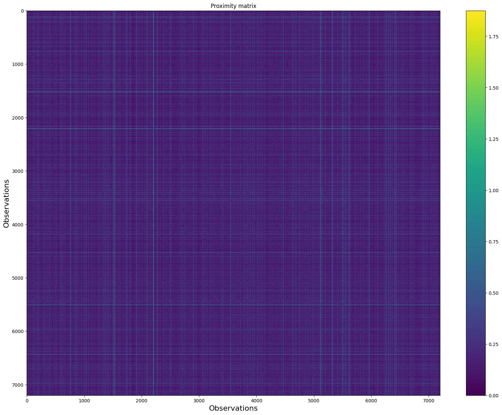
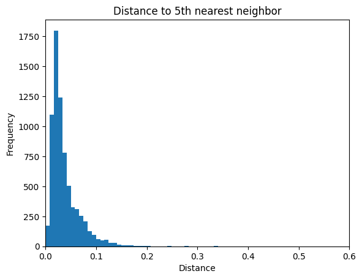
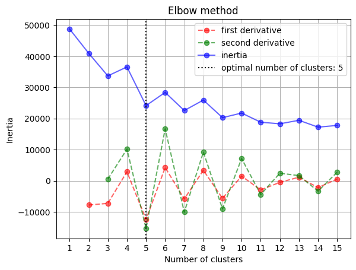

# Unsupervised Anomaly Detection on Mixed-Type Medical Data


Anomaly detection on an unlabeled medical dataset (7,200 observations, 23
mixed numerical/categorical features) using eight detector families —
k-NN distance, LOF, COF, DBSCAN, K-Means, PCA reconstruction, autoencoders,
and a weighted ensemble. Dissimilarity between mixed-type records is
computed with a custom implementation of Gower's distance (Euclidean on
numerical features, Hamming on categorical ones) that runs in ~10 seconds
on the full dataset, faster than the open-source implementations we tried.
The final ensemble flags 402 anomalies (5.58% of the data).

Final project for the **Unsupervised Learning** course, MSc in Artificial
Intelligence (University of Milano-Bicocca), with Andrea Borghesi.

<p align="center"></p>
<p align="center"><em>Final ensemble result: anomalies (red) in PCA and t-SNE
projections of the data. Source: report, Section 8 (ensemble).</em></p>

## Results

| Method | Anomalies flagged | Share of dataset |
|---|---|---|
| k-NN (distance to 5th neighbour, two-step IQR threshold) | 693 | 9.62% |
| Weighted ensemble (K-Means + autoencoder + k-NN) | 402 | 5.58% |

Detector agreement is quantified with the Adjusted Rand Index (report,
Table 1): the better-performing detectors (k-NN, K-Means, autoencoder)
agree with each other far more than with the weaker ones, which motivates
the ensemble. The report's conclusion places the plausible anomaly rate
for this dataset at 5–9%.

## Approach

- **Data cleaning**: 23 → 21 features (two empty columns dropped),
  numerical features standardized with Z-score, booleans cast from strings.
- **Custom Gower distance** for the mixed-type proximity matrix, combining
  Euclidean and Hamming distances per feature type.
- **Thresholding**: anomaly scores thresholded with a two-step
  interquartile-range rule (bounds recomputed after excluding the most
  obvious outliers).
- **Detectors**: proximity-based (k-NN, LOF, COF, DBSCAN), prototype-based
  (K-Means distance), reconstruction-based (PCA error, autoencoder), plus a
  uniform-weight ensemble of the three best performers.
- **Validation**: no labels available — results are inspected visually on
  every pairwise combination of numerical dimensions and cross-checked
  between detectors via Adjusted Rand Index.

<p align="center"></p>
<p align="center"><em>Proximity matrix of the data computed with Gower's
distance. Source: report, Fig. 1.</em></p>

<p align="center"></p>
<p align="center"><em>Distance to the 5th nearest neighbour: the long tail
is what the k-NN detector thresholds. Source: report, Fig. 2.</em></p>

<p align="center"></p>
<p align="center"><em>Elbow method used to pick k for the K-Means detector.
Source: report, Section 6.</em></p>

## How to run

The analysis lives in `Final_project/main.py`, a
[jupytext](https://jupytext.readthedocs.io/) percent-format notebook:

```sh
pip install pandas numpy torch scikit-learn seaborn matplotlib tqdm jupytext
jupytext --to notebook Final_project/main.py   # or open main.py directly in VS Code / Jupyter
```

The dataset is expected under `datasets/`.

## Report

Full write-up: [Unsupervised_Learning__Final_project.pdf](Final_project/Unsupervised_Learning__Final_project.pdf)
— Mirko Morello, Andrea Borghesi, January 2025.
